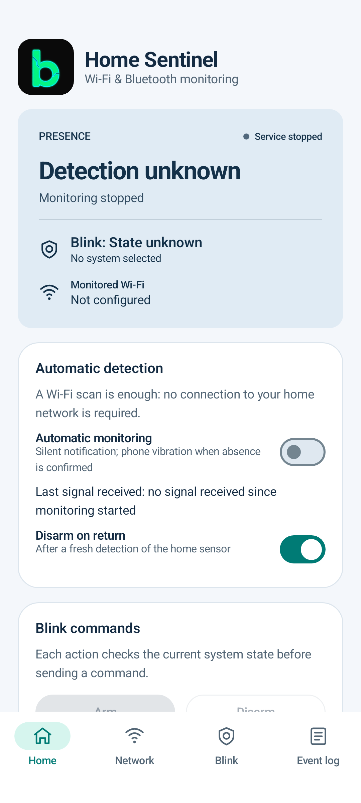
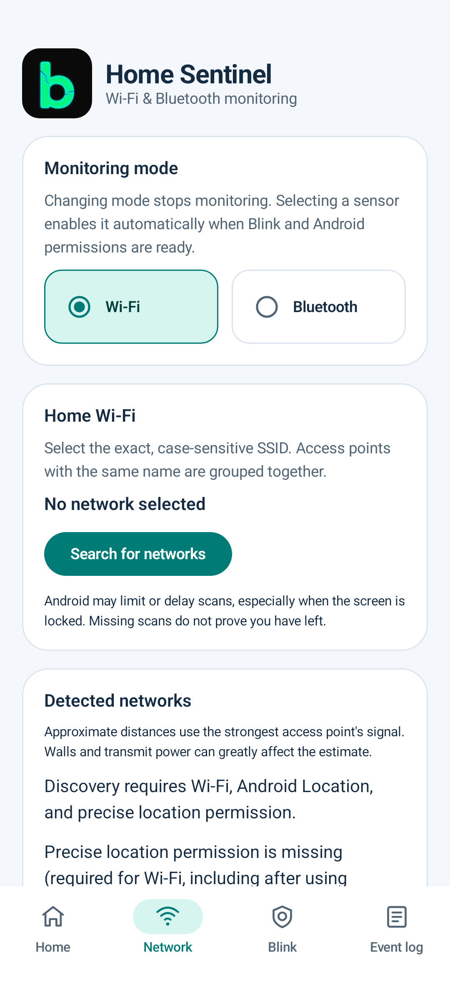
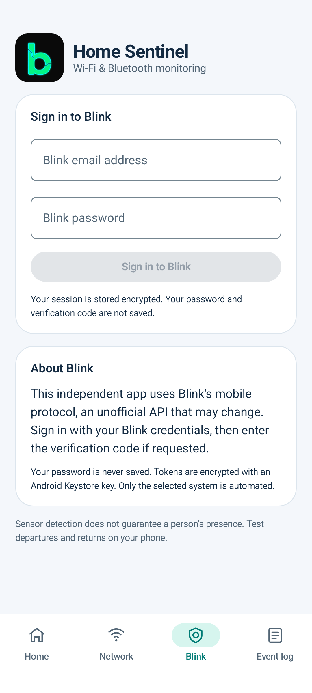
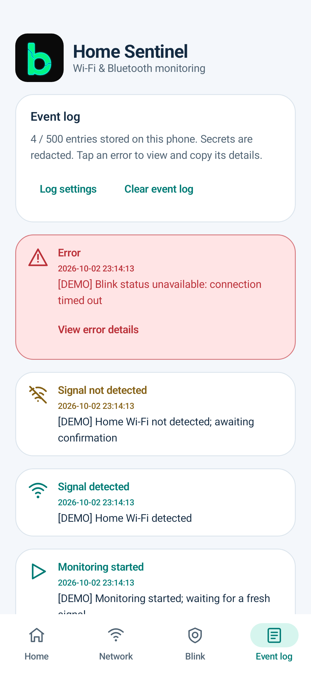
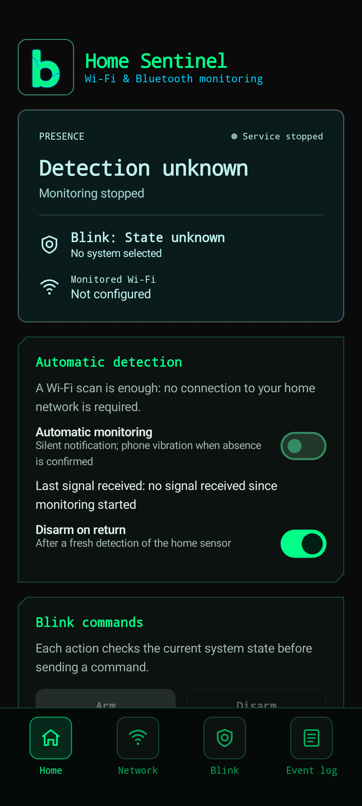
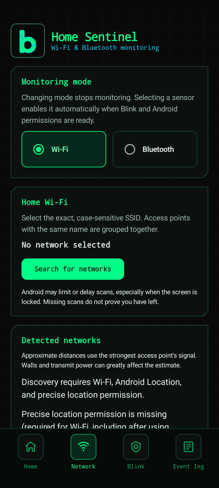
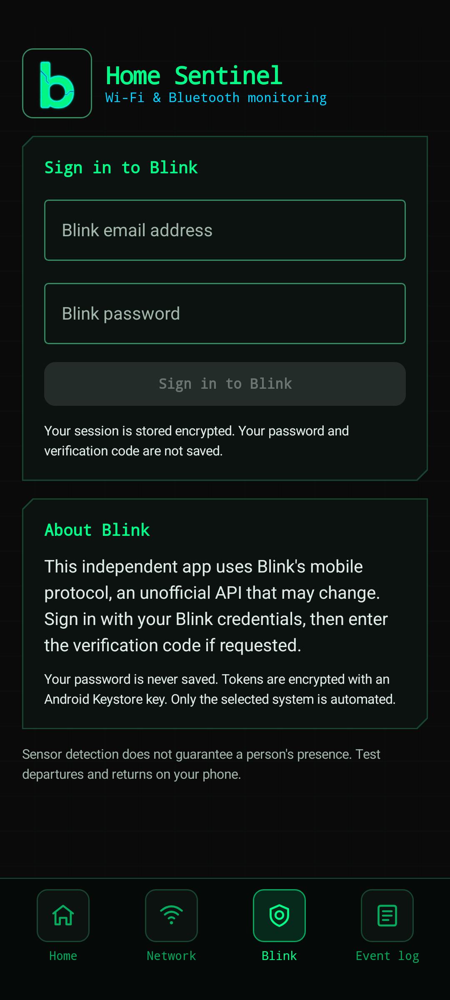
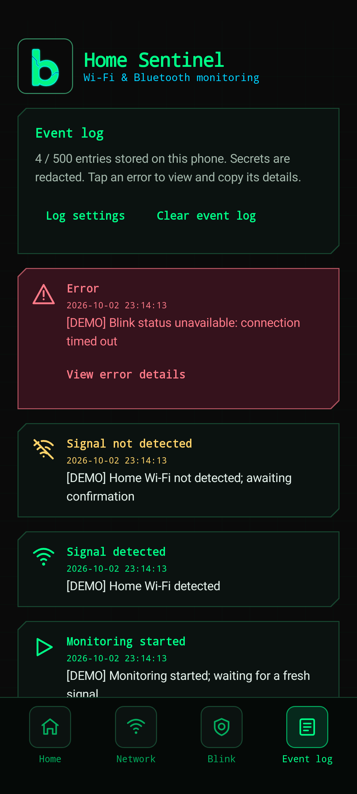
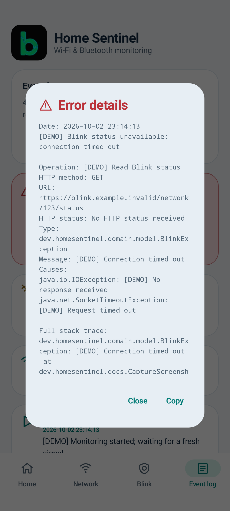
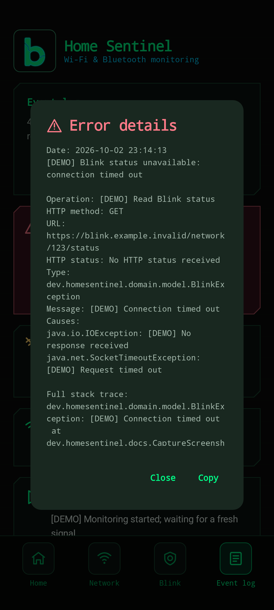

<p align="center">
  
</p>

# Blink Sentinel — Wi-Fi / Bluetooth monitoring

A native Android app built with Kotlin and Jetpack Compose. It arms the selected [Blink](https://blinkforhome.com/) system after a confirmed absence of the home sensor (Wi-Fi or Bluetooth BLE), and optionally disarms it when that sensor reappears. The phone **does not need to connect to the monitored Wi-Fi network**.

## Contents

- **📖 Overview:** [Motivation](#motivation) · [Highlights](#highlights) · [Screenshots](#screenshots) · [Quick start](#quick-start) · [Requirements](#requirements)
- **🛠️ Setup and publishing:** [Open in Android Studio](#open-in-android-studio) · [Build and test](#build-and-test) · [Install](#install) · [GitHub publishing](#github-publishing)
- **📡 Monitoring:** [Sensor selection](#sensor-selection-and-automatic-activation) · [Wi-Fi](#wi-fi-monitoring) · [Bluetooth](#bluetooth-without-location) · [Last signal](#last-received-signal) · [Estimated distance](#estimated-distances-and-sorting)
- **🔔 Alerts and Android:** [Departure alerts](#silent-departure-alerts) · [Event log](#event-log-and-diagnostics) · [Battery access](#background-battery-access) · [Background service](#background-service-and-reboot) · [Permissions](#permissions)
- **🔐 Project details:** [Blink integration and security](#blink-integration-and-security) · [Storage](#storage) · [Architecture](#architecture) · [Real-phone validation](#real-phone-validation) · [Artwork and notices](#artwork-and-notices) · [Changes](#changes-included-in-this-version) · [Technical sources](#technical-sources)

## Motivation

🏠 I was tired of manually arming and disarming my home Blink cameras every time I left or came back. The Blink app did not offer the automatic arm/disarm behavior I wanted based on leaving home. I almost never forget my phone, so I created Blink Sentinel to use the phone as the presence sensor: it can watch for the visibility of my home Wi-Fi network or a compatible Bluetooth LE device, then automate the selected Blink system after a confirmed departure or return.

## Highlights

- 📶 **Wi-Fi presence:** detect the configured home SSID without connecting the phone to that network.
- 📡 **Bluetooth presence:** monitor compatible BLE advertisements on Android 12 and later, including with Location turned off.
- 🏠 **Automatic Blink control:** arm after a delayed, freshly confirmed departure and optionally disarm when the sensor returns.
- 🎨 **Personalized interface:** terminal-inspired dark theme by default, with a Light theme option and a matching app icon.
- 🧾 **Useful diagnostics:** keep up to 500 configurable events, show errors in red with copyable technical details, and redact secrets.
- 🔔 **Quiet alerts:** use a silent monitoring notification and one handset vibration after confirmed departure; the app does not play audio.
- 📏 **Signal estimates:** display indicative RSSI-based distance for sorting; these estimates never control automation.

## Screenshots

Actual application views from an isolated Android 17 / API 37 emulator. The light theme uses navy, teal, and white; the dark theme follows the terminal-inspired visual reference with a near-black background (`#0A0A0A`), neon green (`#00FF88`), cyan (`#00D1FF`), monospace headings, thin frames, and outlined navigation icons. Choose **Dark** or **Light** in **Home → Appearance**; dark is the default. Presence colors always reflect the actual monitoring state.

🖼️ These examples show an unconfigured installation: no Blink account is connected, monitoring is stopped, and no home sensor has been selected. Journal entries marked **[DEMO]** are synthetic documentation fixtures, including an example network error and signal events. They do not change detection or camera state and are never inserted by the application. The captures demonstrate the real interface, not live Blink or real-device radio validation.

### Light theme

| Home | Network | Blink | Event log |
| --- | --- | --- | --- |
|  |  |  |  |

### Dark theme

| Home | Network | Blink | Event log |
| --- | --- | --- | --- |
|  |  |  |  |

### Error details

| Light theme | Dark theme |
| --- | --- |
|  |  |

Full-resolution images and regeneration instructions are in [docs/screenshots/README.md](docs/screenshots/README.md). The application uses a neon **b** adaptive icon inspired by the supplied reference, with a black background and a monochrome layer for themed icons. Original artwork and launcher resources remain included; the notification icon is retained. See [artwork/README.md](artwork/README.md).

If Android Studio's experimental Markdown preview does not load the local images, see the [preview troubleshooting instructions](docs/screenshots/README.md#android-studio-markdown-preview). The PNG files can also be opened directly from `docs/screenshots/`.

The interface, notifications, diagnostics, and documentation are in **English**, regardless of the phone's language. Device names, SSIDs, and Blink system names retain their original values. Dates use `yyyy-MM-dd HH:mm:ss` in the phone's local time zone; estimated distances use an English decimal point. Previously recorded event messages retain their original language.

The project opens directly in Android Studio. A signed debug APK is provided at `dist/blink-sentinel-debug.apk` when included in the delivery.

## Quick start

1. 📦 Install the APK or build the project in Android Studio.
2. 📡 In **Network → Monitoring mode**, choose **Wi-Fi** or **Bluetooth**. Changing mode stops monitoring; selecting a sensor enables it automatically when Blink and Android permissions are ready.
3. 📍 For Wi-Fi, grant precise location and notification permissions in **Home → Android permissions**, enable Wi-Fi and Android Location, then search for and select the exact SSID in **Network**. For Bluetooth on Android 12+, grant **Nearby devices** and notifications, enable Bluetooth, search for up to 22 seconds, and choose a compatible BLE device. Android Location can remain off.
4. 🔐 In **Blink**, enter your **Blink account** email address and password, followed by the verification code if requested. Select the system to automate; a single available system is selected automatically.
5. ⏱️ Set the **Arming delay** between 10 and 600 seconds. The default is 30 seconds; **Disarm on return** is enabled by default. If a sensor was selected before Blink was ready, select it again or enable **Automatic monitoring** on Home.
6. 🔋 In **Home → Android permissions → Background battery use**, tap **Allow unrestricted battery use** and confirm Android’s request if background monitoring is needed. On phones with an additional per-app battery setting, choose **Unrestricted**.
7. ✅ Check the ongoing silent notification and event log. Test an actual departure and return, then confirm the state in the official Blink app.

⚠️ **The arming delay is a minimum confirmation delay, not a guarantee of arming within that time.** Android can delay scans. Missing Android results never become proof of departure.

## Requirements

- Android **10 / API 29 or later** with Wi-Fi. Permission and service branches cover Android 13, 14, 15, and 16, but the actual phone still needs testing.
- Bluetooth without Location requires **Android 12 / API 31 or later**, a BLE-capable phone, and a compatible home device.
- A Blink account with at least one system. Commands apply to a **system**, not individual cameras.
- Internet access when commands run. Mobile data must reach Blink after leaving home.
- Android Studio compatible with **Android Gradle Plugin 9.4.1**, a full compatible **JDK** (validated with JBR / OpenJDK **21.0.11**), SDK Platform **35**, Build-Tools **35.0.0** for the documented verification commands, **36.0.0** for the current AGP build, and Platform-Tools for `adb`.
- Internet access for the first download of Gradle and Google Maven / Maven Central dependencies.

Pinned versions: Kotlin 2.2.10, Compose BOM 2025.04.01, AGP 9.4.1, Gradle 9.6.0. Java/Kotlin bytecode targets Java 17; `compileSdk` and `targetSdk` are 35. AGP 9.4.1 selects Build-Tools 36.0.0 despite the retained `buildToolsVersion = "35.0.0"` declaration; both tool versions were available during validation.

## Open in Android Studio

If using a source archive:

```bash
tar -xzf blink-wifi-automation.tar.gz
```

Use **Open** and select the top-level `blink-wifi-automation` directory containing `settings.gradle.kts`, then wait for Gradle synchronization. Open the whole project, not just `app`.

Under **Settings → Build, Execution, Deployment → Build Tools → Gradle**, select a compatible JDK. Install SDK Platform 35 and Build-Tools 35.0.0 in **SDK Manager**. Android Studio creates `local.properties` with your local SDK path; machine-specific SDK paths should not be distributed.

Connect your phone, enable **Developer options → USB debugging**, accept the computer's RSA key, select the `app` module and phone, then choose **Run**.

## Build and test

The Makefile offers short commands for common Android development tasks. GNU Make, Bash, the Android SDK, and a compatible JDK are required. Run `make` or `make help` to list all targets.

```bash
make test                                      # Run JVM unit tests
make test-one TEST=dev.homesentinel.PresenceMachineTest
make lint                                      # Run Android lint
make check                                     # Run unit tests and lint
make debug                                     # Build the debug APK
make build                                     # Run tests, lint, and build the debug APK
make release-apk                               # Build a local release APK without publishing
make install                                  # Install on a connected Android device
make clean                                    # Remove Gradle build outputs
make tasks                                    # List available Gradle tasks
```

GitHub publishing is separate from local builds: `make push GIT_REPO=OWNER/REPOSITORY GIT_BRANCH=main` commits and pushes the selected branch. `make release VERSION=0.1.0` uses `GIT_MAIN_REPO=https://github.com/0x00F6/blink-sentinel.git` by default, creates a GitHub release, and uploads its APK. Override the release destination with `GIT_MAIN_REPO=https://github.com/OWNER/REPOSITORY.git` when needed.

The same tasks can be run directly through the Gradle wrapper. Linux / macOS:

```bash
./gradlew testDebugUnitTest lintDebug assembleDebug
```

Windows PowerShell:

```powershell
.\gradlew.bat testDebugUnitTest lintDebug assembleDebug
```

If the SDK is not detected, set `ANDROID_HOME` or create `local.properties`:

```properties
sdk.dir=/path/to/Android/Sdk
```

The debug APK is `app/build/outputs/apk/debug/app-debug.apk`, signed with the local debug key. Android Studio's **Build APK(s)** action produces the same kind of APK. `make release-apk` / `assembleRelease` produces an **unsigned** APK unless local release signing is configured. Use **Generate Signed Bundle / APK** for a personal distributable release, retain the same signing key for updates, and never commit it. A different signing key requires uninstalling the old app, which erases its settings and local session.

## Install

With USB debugging and `adb`:

```bash
adb devices
adb install -r app/build/outputs/apk/debug/app-debug.apk
```

For the delivered APK:

```bash
adb install -r dist/blink-sentinel-debug.apk
```

Alternatively, transfer the APK to your phone, open it from a file manager, and allow installation from that source when Android asks. Application ID: `dev.homesentinel`; launcher name: **Blink Sentinel**.

## GitHub publishing

🚀 `Makefile` provides `make push GIT_REPO=OWNER/REPOSITORY GIT_BRANCH=main` to commit and push a branch, and `make release VERSION=0.1.0` to build a release APK and attach it to a GitHub release tagged `v0.1.0`. Releases default to `GIT_MAIN_REPO=https://github.com/0x00F6/blink-sentinel.git`; override it with another GitHub repository URL when needed. Create an empty repository first, install and authenticate the GitHub CLI with `gh auth login`, and configure your Git author. These optional publishing targets require GNU Make and Bash; on Windows, the Gradle wrapper remains available directly. The Makefile and `.gitignore` keep local SDK paths and signing files out of Git; configure release signing locally before sharing an installable production APK. Run `make` or `make help` to view the commands.

## Sensor selection and automatic activation

Selecting a Wi-Fi network, using a manually entered SSID, or choosing a Bluetooth device saves the target and starts monitoring with the existing silent notification. Any Bluetooth discovery is stopped first. A Blink session, selected Blink system, and the chosen mode's Android permissions are required. If a prerequisite is missing or Android refuses startup, the selection is retained, monitoring is disabled, and an actionable message is shown. Correct the prerequisite, then select the sensor again or enable monitoring on Home.

Changing the sensor requires fresh observations. Selecting a device never establishes presence or absence by itself, and does not bypass the arming delay.

## Wi-Fi monitoring

`WifiScanReceiver` dynamically listens for `SCAN_RESULTS_AVAILABLE_ACTION`. On Android 10+, this includes full scans performed by Android or other apps, allowing passive listening. Presence means visibility of the **exact, case-sensitive configured SSID**, regardless of whether the phone is connected to it. `ConnectivityManager` requests scans after connection changes and retries commands when Internet access returns; losing a connection or disabling Wi-Fi does not prove departure.

A presence observation is accepted only when:

- The broadcast reports `EXTRA_RESULTS_UPDATED = true`.
- Wi-Fi, Android Location, and precise location permission are available.
- Individual monotonic result timestamps are no more than 60 seconds old.
- The batch is newer than the previously accepted batch.

Android may mix old and new results; each timestamp is checked independently. A cached SSID is not fresh presence. A successful empty scan can establish absence; a failed or refused scan cannot.

| State | Meaning | Action |
| --- | --- | --- |
| `UNKNOWN` | No usable sensor evidence | No automatic command |
| `HOME` | Home SSID visible in a recent scan | Disarm if enabled |
| `AWAY_PENDING` | First absence observation | Wait for the configured delay |
| `AWAY` | Another fresh absent scan after the delay | Check Blink, then arm |

When the delay ends, the service requests **one** scan; the timer never confirms absence itself. A return before confirmation cancels departure. Changes to the SSID, system, or delay reset the decision. Five minutes without valid observations resets detection to `UNKNOWN`. A deferred Blink attempt requires evidence less than 60 seconds old.

The Wi-Fi selection list loads cached results younger than 60 seconds on opening or resuming, then requests a scan. Automatic UI requests are spaced at least 30 seconds apart; no extra background polling is added. Cached display results never become presence evidence. The list explains missing permissions, disabled Wi-Fi or Location, and Android scan refusals. Buttons open precise location permission and Location settings, including after switching from Bluetooth. Distances and proximity sorting are retained.

One-off scans are requested when monitoring starts, connectivity changes, the screen wakes, and the absence delay ends. **Supplemental scans** optionally request a scan every two minutes; this is off by default and remains subject to Android throttling.

### Android limitations

Foreground apps can generally request four scans in two minutes; background apps share a much stricter limit, generally one scan every thirty minutes. A foreground service keeps the process visible and supports permitted location access; it does not bypass quotas, Doze, or manufacturer restrictions.

An ordinary app **cannot guarantee immediate, continuous SSID detection while the phone is locked**. With no new system scans, passive monitoring waits. Supplemental scans may help on some devices but do not guarantee a frequency.

Hidden SSIDs are unsuitable for reliable name-based monitoring. Access points sharing a name count as the same home. An SSID does not authenticate a home or person: an impersonated SSID can trigger presence and disarming. Monitoring follows this phone, not multiple occupants.

## Bluetooth without Location

This mode requires **Android 12 / API 31+**, BLE support, and `BLUETOOTH_SCAN` / `BLUETOOTH_CONNECT` permissions in **Nearby devices**. `BLUETOOTH_SCAN` declares `neverForLocation`; neither location permission nor the Location switch is required. Android 10/11 require Location for ordinary BLE scanning, so this app offers only Wi-Fi mode on those versions.

The home device must be stationary, continuously powered, advertise BLE every few seconds, and retain a **stable Bluetooth address**. Bonding and classic Bluetooth connections are not presence evidence. Classic-only speakers, devices that stop advertising while connected, and rotating private addresses are unsuitable. Android filters some beacons with `neverForLocation`; confirm the device remains detectable with Location off before using it. Addresses and BLE advertisements do not authenticate the home and can be imitated.

Discovery lasts up to **22 seconds**: roughly 14 seconds of classic discovery followed by eight seconds of BLE scanning. It stops monitoring to avoid radio interference. Selecting a device stops discovery and automatically activates monitoring when the prerequisites are ready. Duplicate discovery requests are prevented, and scanners/receivers are cleaned up on completion or cancellation.

Names come from BLE advertisements, with fallback to Android's known names. Previously resolved names are retained across unnamed advertisements. Classic devices detected during discovery are also listed. Bonded-device metadata can complete a name, but bonding alone never creates a visible entry. Put unpaired classic devices into discoverable mode. If no name is available, the entry shows **Name not provided** and its address.

All displayed devices are selectable. Entries disappear after **30 seconds without a radio observation**, even if their bond/name is still known. A metadata change does not extend freshness. Search again to refresh; no extra continuous discovery is introduced. Disappearance means the observation expired, not a certain physical range measurement. Classic selections are saved, but automatic monitoring still requires actual BLE advertisements; a classic-only device leaves detection unknown.

Home displays **Monitored Wi-Fi** and the SSID in Wi-Fi mode, or **Monitored Bluetooth** and the selected name/address in Bluetooth mode, directly from current settings.

Monitoring uses a continuous BLE scan **filtered by the chosen address**, in a **connectedDevice** foreground service. The filter supports delivery with the screen off. No permanent wake locks, exact alarms, or repeated service starts are used. Android, Doze, or the manufacturer can still suspend the process or delivery; test on the actual phone.

Advertisement timestamps are monotonic, converted from nanoseconds to milliseconds. A ten-second window containing a recent advertisement establishes presence. After the first empty window, monitoring waits for the arming delay and requires another absent window. A fresh return signal cancels departure immediately. Stale/future advertisements and duplicates cannot confirm departure.

After startup, restart, or a window delayed by more than twenty seconds, detection remains `UNKNOWN` until a real advertisement is received. Starting while away therefore requires a detected return before another departure decision. Bluetooth off, revoked permission, or an explicit scanner error means unknown, with no arming. Radio silence can also mean power loss or interference; it does not guarantee a person's absence.

## Last received signal

**Home → Automatic detection → Last signal received** shows the last actual reception of the chosen SSID/device as **yyyy-MM-dd HH:mm:ss** in the phone's local time zone. It is the phone's reception timestamp, not the transmitter's clock. Android monotonic timestamps are converted to wall-clock time on receipt.

The timestamp does not advance on absence, timers, duplicate results, or a BLE window without a new advertisement. It remains visible during absence or sensor unavailability and after stopping the service in the same process. Changing sensor/mode or restarting monitoring clears it. It is not persisted and never replays an arming decision.

## Estimated distances and sorting

Wi-Fi, BLE, and classic Bluetooth lists show **estimated distance in meters** from received RSSI, sorted nearest first. Missing/invalid RSSI shows **Estimated distance: unavailable** and sorts last. BLE and classic devices are sorted together; their types remain visible. Distances update with discovery observations.

This is an indicative radio model, **not a measured distance**:

```text
d = 10^((assumed RSSI at 1 m − received RSSI) / (10 × 2.5))
```

Assumed references are −40 dBm for Wi-Fi and −59 dBm for Bluetooth. Transmit power, walls, band, and antennas can substantially distort values and ranking. BLE transmit power is not treated as calibrated RSSI at one meter. For a shared SSID, the strongest access point is used. No GPS or additional permission is involved. Distances affect only display, never presence or arming decisions.

## Silent departure alerts

Notifications use **Silent Wi-Fi / Bluetooth monitoring**, configured with no sound and no automatic vibration on updates. The channel has a new ID to avoid inheriting older default sound settings retained by Android. The app does not play audio.

Following an observed `HOME`, confirmed `AWAY` triggers **one 300 ms vibration on the phone**. The arming delay and second confirmation remain required. Pending absence, rapid returns, unknown sensors, duplicate scans, and restarting while already away do not vibrate. A new return permits one vibration for the next confirmed departure. This indicates sensor absence, not success of a Blink command.

`VIBRATE` is a normal manifest permission. Silent mode, **Do Not Disturb**, missing vibrator hardware, and platform restrictions can suppress vibration. The app does not change headphone audio settings. Headphone firmware disconnect sounds or other apps' notifications are outside its control. Users retain control over Android channel settings; keep this channel silent.

Test with headphones connected: confirmed departure gives one handset vibration and no app sound; rapid return gives none; repeated `AWAY` updates do not repeat it. Also test with the screen locked, silent mode, and Do Not Disturb.

## Event log and diagnostics

Errors appear **in red with a date, warning icon, and explicit message**, inside a red framed card. Tap the card or **View error details** for scrollable, selectable, copyable details: operation, HTTP method, actual request URL, HTTP status, exception type/message, causes, and full stack trace. Failure before a response shows **No HTTP status received**. Interrupted reads after headers retain the received status. Parsing failures remain associated with their request.

The persistent log keeps **500 entries by default**, newest first. Open **Event log → Log settings → Entries to keep** to choose **50–5000**, then tap **Save**. The setting survives app restarts. Lowering it immediately removes the oldest entries; increasing it cannot restore deleted history. Changing journal retention does not reset sensor evidence or pending automation. **Use default (500)** restores the default value in the dialog.

Distinct outline icons identify detected signals, missing signals, confirmed absence, unknown signals, waiting for confirmation, monitoring start/stop, Blink arming/disarming, account events, information, and errors. Types are recorded at the event source and preserved with the journal. Historical entries without a type use the information icon; historical error flags and details still identify errors. A timer’s waiting event never means absence was confirmed.

Passwords, tokens, codes, secrets, cookies, authorization values, URL credentials, and query values are redacted **before storage and display**. The marker is `[REDACTED]`. HTTP bodies, forms, and headers are never added to the log. Original network causes are retained, including DNS, connection, TLS, and interrupted reads. Copying uses already sanitized text. Older events remain available in their original language.

## Background battery access

In **Home → Android permissions → Background battery use**, the **Allow unrestricted battery use** button requests a battery-optimization exemption specifically for Blink Sentinel. Android shows its own confirmation; allow it to reduce power-saving interference with home-sensor monitoring. This can increase battery consumption. The app does not change this setting silently or request it on startup.

The displayed status comes from Android's `isIgnoringBatteryOptimizations` and refreshes when you return to the app. If exemption is already granted, the button becomes **Open battery settings**. If a phone does not support the direct request, the app opens the general optimization list, then app details as a fallback. Select Blink Sentinel and disable optimization there. Some manufacturers additionally expose **App info → Battery → Unrestricted**; on Samsung, also use **Never sleeping apps** if needed.

The exemption is **partial**. It can improve background network availability but does not remove every Android or manufacturer restriction, Wi-Fi scan quotas, foreground-service requirements, or Bluetooth delivery limitations. Keep the silent foreground notification, test with the screen locked, and do not assume continuous operation is guaranteed. Denying or canceling the request leaves the existing Android setting unchanged.

## Background service and reboot

`WifiMonitorService` uses the **location** service type in Wi-Fi mode and **connectedDevice** in Bluetooth mode. It starts from the visible interface with the chosen mode's permissions. It can continue while the interface is closed or the phone is locked, subject to Android restrictions.

Boot recovery requires the relevant permissions. Wi-Fi background recovery requires separately granted background location; without the necessary access, a silent notification asks the user to open the app. Bluetooth recovery requires Android 12+ and retained Nearby devices permissions. Android background-start restrictions still apply; a refused recovery is reported rather than repeatedly retried. A restart always requires new evidence.

## Permissions

| Permission | Purpose | Request |
| --- | --- | --- |
| `ACCESS_WIFI_STATE` | Read scan results | Manifest |
| `CHANGE_WIFI_STATE` | Request one-off scans | Manifest |
| `ACCESS_COARSE_LOCATION` + `ACCESS_FINE_LOCATION` | Read SSIDs with precise access | Runtime, requested together |
| `ACCESS_BACKGROUND_LOCATION` | Wi-Fi boot recovery from background | Optional, separate step |
| `BLUETOOTH_SCAN` (`neverForLocation`) + `BLUETOOTH_CONNECT` | Discovery and BLE monitoring without Location, Android 12+ | Runtime, Bluetooth mode |
| `BLUETOOTH` + `BLUETOOTH_ADMIN` (max API 30) | Legacy declarations; no Location-free BLE mode on Android 10/11 | Manifest |
| `FOREGROUND_SERVICE` + `FOREGROUND_SERVICE_LOCATION` | Wi-Fi foreground service | Manifest |
| `FOREGROUND_SERVICE_CONNECTED_DEVICE` | Bluetooth foreground service, Android 14+ | Manifest |
| `REQUEST_IGNORE_BATTERY_OPTIMIZATIONS` | Package-specific battery exemption request after a user tap | Manifest; Android confirmation |
| `VIBRATE` | Handset vibration on confirmed departure | Manifest, no runtime prompt |
| `POST_NOTIFICATIONS` | Service notification and resume reminder, Android 13+ | Runtime |
| `INTERNET` | Blink HTTPS authentication and commands | Manifest |
| `ACCESS_NETWORK_STATE` | Observe network availability | Manifest |
| `RECEIVE_BOOT_COMPLETED` | Boot recovery | Manifest |

`NEARBY_WIFI_DEVICES` is not requested: `getScanResults` / `startScan` still require `ACCESS_FINE_LOCATION`, including Android 13+. Nearby permission alone does not authorize these results. Location must be enabled **in Wi-Fi mode**. No GPS API is called and no coordinates are sent.

Without notification permission on Android 13+, Android may allow the service while showing it only in the active-apps task manager; boot reminders will not be visible.

## Blink integration and security

`BlinkService` is the domain interface. `BlinkApiService` implements the mobile protocol observed in **blinkpy 0.25.9**: OAuth v2 with PKCE, memory-only cookies, CSRF, explicit 2FA, and access/refresh tokens. It recognizes HTTP 412 and HTTP 202 responses carrying 2FA information. It uses a stable UUID hardware identifier and community-observed client parameters centralized in the adapter.

⚠️ This arming/disarming API is **unofficial and unsupported**. Blink's official EU data portability API does not document these commands. Authentication can fail because of account conditions, protocol changes, service protections, or network restrictions. HTTP 403, 406, and 429 are reported with actionable errors. Amazon SSO or CAPTCHA changes would require adapter changes; no protection bypass is implemented.

Regional URLs always use `rest-`: region `e005` becomes **`https://rest-e005.immedia-semi.com/`**, including older persisted sessions. An existing `rest-e005` prefix is not duplicated. Systems come from `homescreen`. Before a command, `EnsureBlinkState` queries the real state; matching states avoid duplicate POSTs, and unknown state blocks the command. After a POST, the adapter checks up to five times at two-second intervals for actual confirmation. HTTP acceptance alone is not confirmed success.

Network/server retries are bounded to four attempts, separated by 15, 30, and 60 seconds, and require fresh sensor evidence. New evidence or restored Internet can trigger reconciliation. Authentication, protocol, and rate-limit errors stop retries. Each retry reads real state first rather than blindly replaying an ambiguous POST.

The selected system ID is captured before status lookup and passed explicitly to the command. Selection changes cancel an action rather than redirecting it to a different system. Persisted settings are checked again before automatic effects, independently of Flow timing.

New evidence cancels obsolete work and its HTTP call. If Blink already received a command, cancellation cannot recall it; the next desired state is queried and reconciled. Account for cloud latency in real tests.

### Storage

- Passwords and 2FA codes are never saved in preferences, saved UI state, or logs.
- Tokens, account ID, region, and UUID use `noBackupFilesDir`, **AES-256-GCM**, a non-exportable **Android Keystore** key, and atomic writes.
- Non-secret settings use **Preferences DataStore**. The bounded local event log excludes secrets and HTTP bodies.
- Android backup and app-data transfer are excluded. TLS validation remains enabled; cleartext HTTP is forbidden by the manifest.
- `FLAG_SECURE` restricts screenshots and recent-app previews.
- A corrupt session or lost key requires reauthentication. No plaintext fallback exists.
- **Sign out of Blink** clears the local session and stops monitoring. It does not claim server-side token revocation; use the official Blink app for remote account/device management.

## Architecture

```text
app/src/main/java/dev/homesentinel/
├── data/
│   ├── blink/          # OAuth, HTTPS, strict parsing, Keystore vault
│   ├── bluetooth/      # Filtered BLE scans and observation windows
│   ├── wifi/           # WifiManager adapter and freshness policy
│   └── preferences/    # DataStore and bounded local event log
├── domain/
│   ├── model/          # Settings, Presence, BlinkStatus, WifiEvidence
│   ├── repository/     # BlinkService and WifiScanner
│   └── usecase/        # Presence, command serialization, activation
├── service/
│   ├── WifiMonitorService.kt
│   ├── BlinkAutomationService.kt
│   └── MonitorNotifications.kt
├── receiver/           # Wi-Fi broadcasts and boot recovery
├── ui/
│   ├── screens/        # Home, Network, Blink, Event log
│   ├── components/
│   ├── theme/
│   └── SentinelViewModel.kt
├── MainActivity.kt
└── SentinelApplication.kt
```

`SentinelApplication` / `AppGraph` provide application-scoped dependencies and restoration without a DI framework. `StateFlow` drives Compose; network coroutines are cancellable. A mutex serializes manual/automatic commands. Pure policies are JVM-testable, with injected clocks and MockWebServer endpoints. No periodic WorkManager job polls Wi-Fi or bypasses Android limits.

## Real-phone validation

Automated tests use local **MockWebServer** and fictitious sessions, not a live Blink account. Builds and simulated tests do not validate radio behavior, background delivery, or Blink's actual service. See [VALIDATION.md](VALIDATION.md) for exact commands, results, and limitations.

### Wi-Fi

1. Authenticate with a real account, select the system, and compare state with official Blink.
2. Keep Wi-Fi on but disable automatic connection to home; check that scans still detect the SSID.
3. Leave home with mobile Internet available. Check `AWAY_PENDING`, then `AWAY` only after fresh confirmation and the delay; verify Blink's actual state.
4. Return before confirmation: no arming command should be sent. Return after arming: check optional disarming.
5. Disable Wi-Fi or Location: detection should become unknown without arming from that action alone. Turning Wi-Fi off is not a valid simulated departure.
6. Test prolonged screen lock, optional supplemental scans, Internet loss, reopening, and reboot with/without background location. Test the battery button by allowing, denying and canceling the request; verify status on return and behavior with manufacturer restrictions.
7. Switch from Bluetooth with Location off. Check the Wi-Fi list's permission/Location buttons, automatic scan on return, distances, sorting, and scan-refusal messages.

### Bluetooth and diagnostics

1. On Android 12+, turn Location off, enable Bluetooth, grant Nearby devices, and discover a compatible device. Verify names, selectable entries, sorting, and expiry after 30 seconds without observation.
2. Select a device during discovery: check discovery stops, monitoring starts automatically with the silent notification, and `HOME` requires an actual signal.
3. Lock the phone and leave with mobile Internet. Check pending absence, delay, fresh confirmation, one handset vibration, no app audio, and the actual Blink state.
4. Return before confirmation to cancel, or after arming to verify optional disarming. Check the last-signal date/time changes only with a new actual reception.
5. Disable Bluetooth or revoke permission: expect unknown without arming. Restore it and require fresh evidence.
6. Test prolonged Doze, reboot, and sensor changes. A restart without a received advertisement must stay unknown.
7. Trigger a network failure with no real secrets in logs. Check the red dated error, English diagnostic fields, original causes, full trace, scroll/copy, and redaction.
8. Select a sensor without Blink or permissions ready: confirm the choice is retained, monitoring remains disabled, and the message identifies the prerequisite.

## Artwork and notices

The original house / shield / Wi-Fi / camera logo is included at `artwork/logo.png`, displayed in the UI, and packaged in the adaptive launcher icon. Resources include a dedicated background, inset foreground, Android 13+ monochrome layer, and white notification icon. See [artwork/README.md](artwork/README.md), [LICENSE](LICENSE), and [THIRD_PARTY_NOTICES.md](THIRD_PARTY_NOTICES.md).

## Changes included in this version

- Wi-Fi/Bluetooth mode selection and reactive Home sensor labels.
- Android 12+ BLE monitoring with Location off, version-specific permissions, screen-off filtering, compatibility guidance, arming delay and transient-loss protection.
- Advertised/Android device names, classic Bluetooth discovery, selectable entries, radio-observation expiry, estimated distances and nearest-first sorting.
- Automatic monitoring activation when a sensor is selected, with retained selection and clear prerequisite/startup errors.
- Wi-Fi picker refresh on opening/resume, recent cache display separated from presence evidence, and permission/Location/scan-refusal guidance.
- Silent notification and one handset-only vibration after a confirmed departure.
- Last actual signal date/time including seconds on Home.
- Correct regional Blink URLs using `rest-e005.immedia-semi.com`.
- Persistent red dated errors with copyable complete HTTP/exception diagnostics and secret redaction.
- English interface, notifications, error messages, documentation and relevant code comments.
- App-specific battery exemption button, actual status refresh, and manufacturer/settings fallbacks.

These behaviors and their preservation rules are also documented in [AGENTS.md](AGENTS.md). Exact build/test results and real-device limitations are in [VALIDATION.md](VALIDATION.md).

## Technical sources

- [Android — Doze, App Standby, and battery exemptions](https://developer.android.com/training/monitoring-device-state/doze-standby)
- [Android — notification channels](https://developer.android.com/develop/ui/views/notifications/channels)
- [Android — haptics APIs](https://developer.android.com/develop/ui/views/haptics/haptics-apis)
- [Android — Bluetooth permissions](https://developer.android.com/develop/connectivity/bluetooth/bt-permissions)
- [Android — BLE background](https://developer.android.com/develop/connectivity/bluetooth/ble/background)
- [Android — Wi-Fi scanning](https://developer.android.com/develop/connectivity/wifi/wifi-scan)
- [Android — foreground service types](https://developer.android.com/develop/background-work/services/fgs/service-types)
- [Android — location permissions](https://developer.android.com/develop/sensors-and-location/location/permissions)
- [Android — Wi-Fi permissions](https://developer.android.com/develop/connectivity/wifi/wifi-permissions)
- [blinkpy source and releases](https://github.com/fronzbot/blinkpy)
- [Blink — HTTP 406 errors](https://support.blinkforhome.com/fr_FR/how-to-resolve-http-406-errors)
- [Blink — EU data portability](https://support.blinkforhome.com/fr_FR/contact-support/transfer-your-blink-data-to-third-parties)

Blink Sentinel is independent and is not affiliated with Amazon or Blink.
